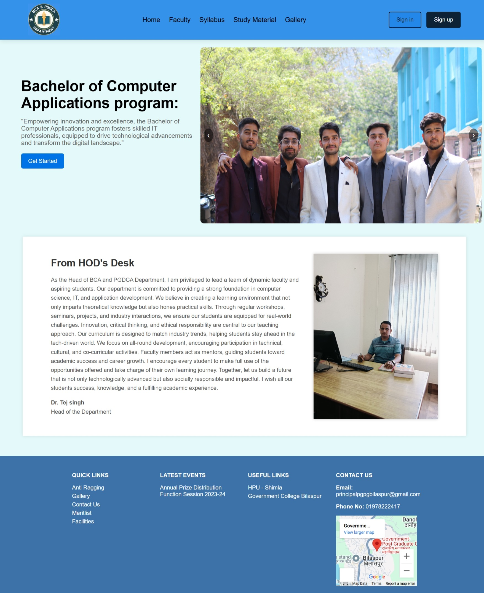
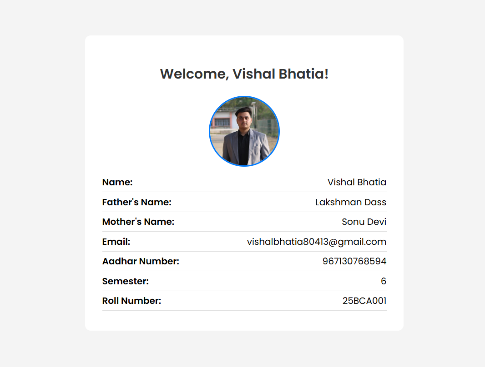
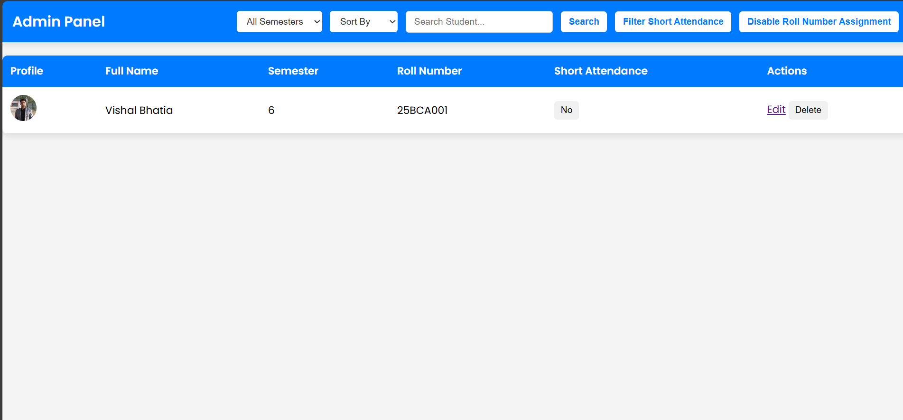
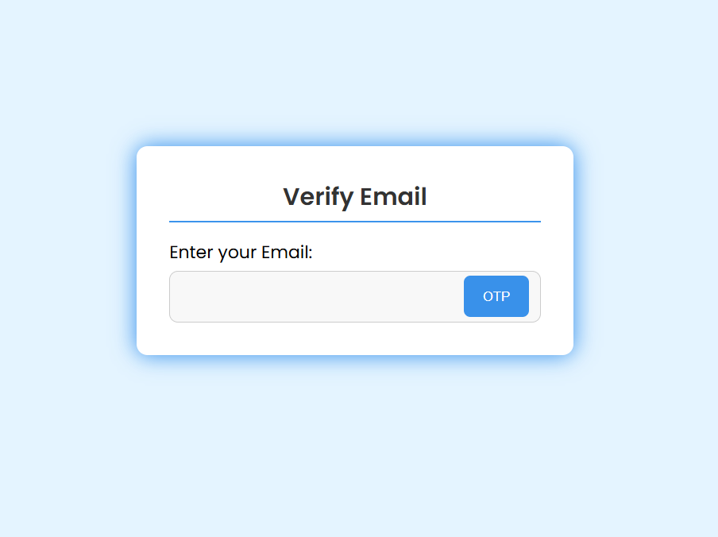
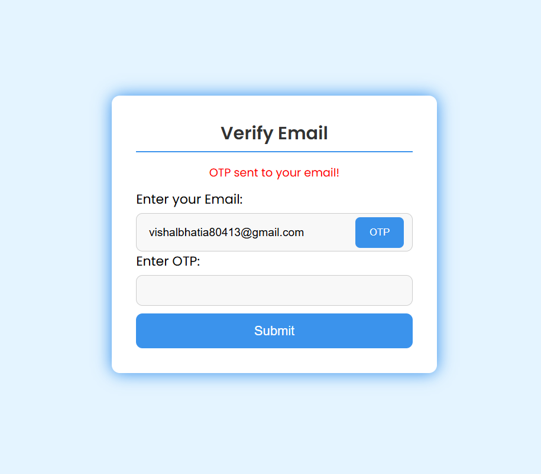
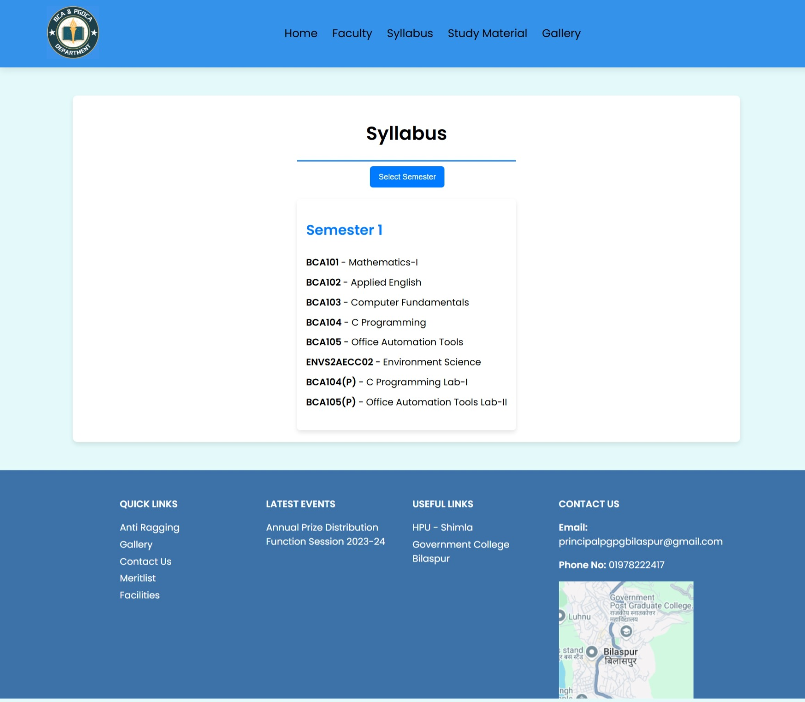
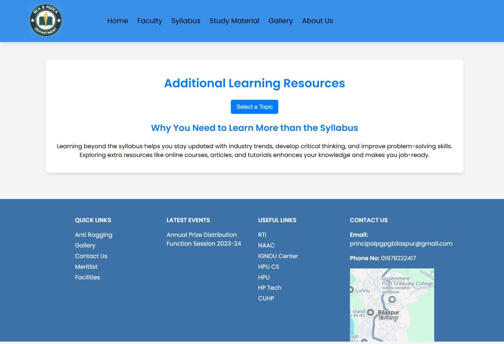

# 🎓 Student Management System – BCA Department

> A full-stack web application to manage student records, attendance, and academic resources built using **Node.js**, **Express.js**, **MongoDB**, and **EJS**.



---

## 🔍 Overview

Managing student records manually is inefficient, especially with growing data and admin pressure in colleges. So we built a **Student Management System** to simplify things.

It’s a web-based solution that helps administrators and students handle enrolment, attendance, profiles, and even syllabus info—all from one place. We’ve focused on building something that’s both practical and easy to use, with secure logins, real-time updates, and automation to reduce human errors.

---

## 🎓 Project Background

This system was created as part of our **final-year project** for the completion of our **BCA degree**. We worked on it as a group of friends, combining our coding skills and late-night brainstorming sessions to design something meaningful for both students and admins.

Our aim wasn’t just to fulfill academic requirements, but to actually solve a real issue we’ve seen throughout our college life—messy, paper-based student data systems. This project is our contribution to making that experience a bit better.

---

## 🧩 Features

### ‍🎓 Student Portal

- Login & view personal profile
- Track attendance (with warnings if it’s short)
- Access syllabus & academic notifications





### ‍💼 Admin Panel

- Dashboard with all student records
- Auto-assign roll numbers
- Edit/delete student details
- Mark short attendance



### Secure Authentication

- Email verification during signup
- OTP-based password recovery system




### 📚 Academic Section

- Faculty & department listing
- Semester-wise syllabus
- Extra learning resources like Git, Linux, Docker





---

## ⚙️ Tech Stack

| Layer        | Tech Used                  |
| ------------ | -------------------------- |
| Frontend     | HTML, CSS, JavaScript, EJS |
| Backend      | Node.js, Express.js        |
| Database     | MongoDB                    |
| Email & Auth | bcrypt, JWT, Nodemailer    |
| File Uploads | Multer                     |

---

## 🛠️ System Architecture

The system follows a classic client-server architecture:

- MongoDB for database storage
- Node.js + Express.js for backend API and server logic
- EJS templating for dynamic views
- JWT & bcrypt for authentication
- Nodemailer for OTP via email

Everything is designed to be modular and easily extendable.

---

## 🗃️ Database Design

We’ve kept the structure clean and flexible:

- `students` – personal data, semester, attendance, image
- `studentRegs` – login credentials and hashed passwords
- `admins` – admin login and creator info
- `otp` – temporary OTP storage for password resets
- `adminSettings` – global toggles for features
- `globalData.js` – static faculty, syllabus, and resources info

Example student object:

```json
{
  "fullName": "Amit Sharma",
  "email": "amit@example.com",
  "rollNumber": "BCA23-AM",
  "semester": "4",
  "shortAttendance": true
}
```

---

## How to Run

### 🧾 Prerequisites

- Node.js and npm
- MongoDB (local or cloud)
- Mail credentials for sending OTPs

### 📦 Installation

```bash
git clone https://github.com/your-username/student-management-system.git
cd student-management-system
npm install
npm run dev
```

Make sure to fill in `.env` for MongoDB URI and email credentials.

---

## ✅ Testing & Deployment

We tested the project using a mix of:

- 🧪 Unit Testing (modules like login, OTP)
- 🔄 Integration Testing (frontend <-> backend)
- 🧱 System Testing (complete user flow)
- 🧑‍🔬 Acceptance Testing (tested live with demo users)

We followed both black-box and white-box approaches to cover all critical paths and edge cases.

---

## 🧭 Future Scope

- 📊 Analytics dashboard for tracking student performance
- 📱 Mobile app integration
- 📅 Auto-notifications for attendance, exams, deadlines
- 🧠 AI-based prediction & suggestion engine for students

The codebase is modular, so adding these will be easy in future iterations.

---

## 📷 Screenshots Summary

| Home                      | Login                                        | Admin                                   |
| ------------------------- | -------------------------------------------- | --------------------------------------- |
|  |  |  |

---

## 📜 License

MIT License – Free to modify, learn from, or contribute.

---

> Made with hard work, caffeine, and teamwork – for a smoother academic life.
